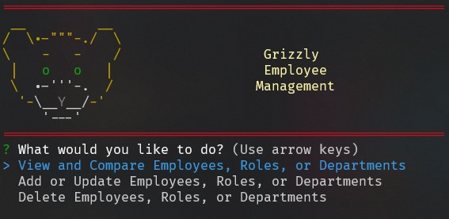

# Grizzly Employee Management



## Description

Manage a database of employees and departments through a SSH-friendly console application.

## Table of Contents

- [Installation](#installation)
- [Usage](#usage)
- [License](#license)

## Installation

The easiest way to install Grizzly Employee Management is to clone this repository using the following command.

```
git@github.com:bear-evans/employee-management-system.git
```

Once downloaded, you can install its dependencies by navigating to the GEM's directory and issuing the following command.

```
npm install
```

This will install `express`, `mysql`, `chalk`, `inquirer` and `dotenv`.

A database schema and a seed file are included for convenience.

Additionally, you will need to add a .env file specifying your username, password, and host for the MySQL connection.

## Usage

To initiate the application, run

```
node server.js
```

from the app's directory.

A demonstration video of the app's functionality can be found [here](https://www.youtube.com/watch?v=nw3FMzSCv24).

## Tests

There are no tests for the Grizzly Employee Management application at this time.

## License

Copyright 2021 Bear Evans

Permission is hereby granted, free of charge, to any person obtaining a copy of this software and associated documentation files (the "Software"), to deal in the Software without restriction, including without limitation the rights to use, copy, modify, merge, publish, distribute, sublicense, and/or sell copies of the Software, and to permit persons to whom the Software is furnished to do so, subject to the following conditions:

The above copyright notice and this permission notice shall be included in all copies or substantial portions of the Software.

THE SOFTWARE IS PROVIDED "AS IS", WITHOUT WARRANTY OF ANY KIND, EXPRESS OR IMPLIED, INCLUDING BUT NOT LIMITED TO THE WARRANTIES OF MERCHANTABILITY, FITNESS FOR A PARTICULAR PURPOSE AND NONINFRINGEMENT. IN NO EVENT SHALL THE AUTHORS OR COPYRIGHT HOLDERS BE LIABLE FOR ANY CLAIM, DAMAGES OR OTHER LIABILITY, WHETHER IN AN ACTION OF CONTRACT, TORT OR OTHERWISE, ARISING FROM, OUT OF OR IN CONNECTION WITH THE SOFTWARE OR THE USE OR OTHER DEALINGS IN THE SOFTWARE.
